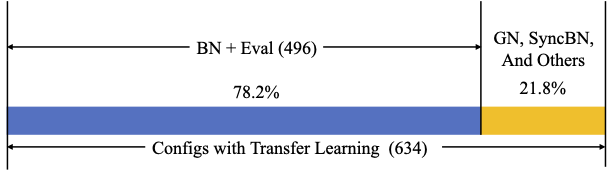
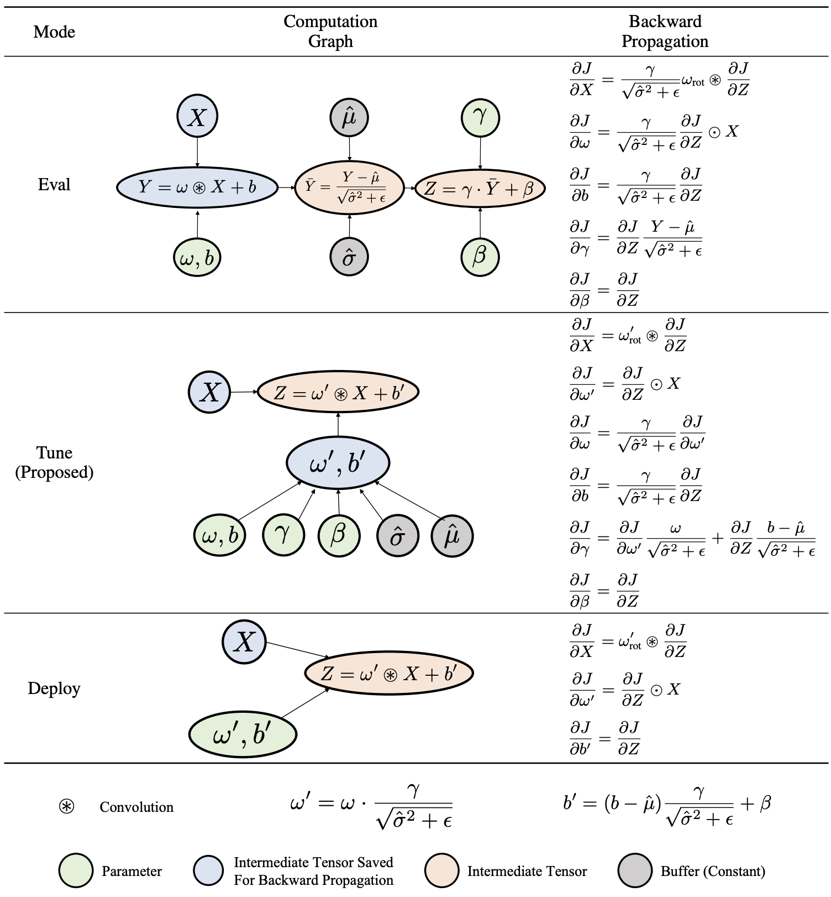
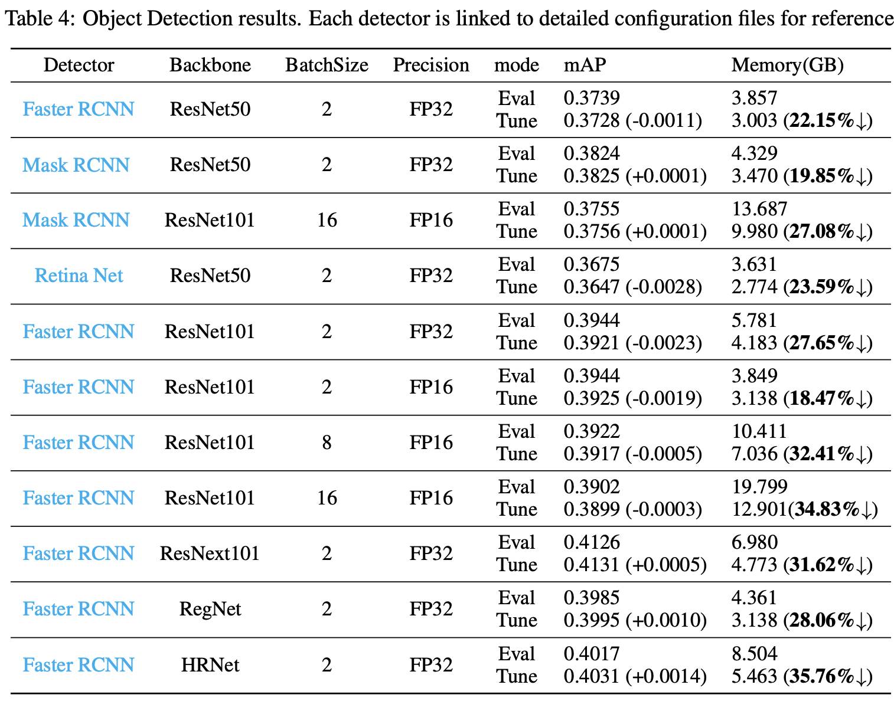
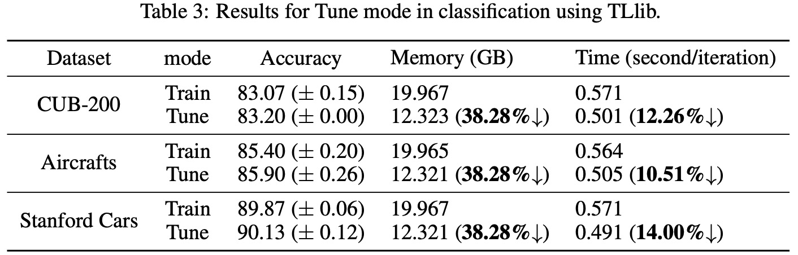

# Tune-Mode ConvBN Blocks

This software project accompanies the research paper, [Tune-Mode ConvBN Blocks For Efficient Transfer Learning](https://arxiv.org/abs/2305.11624).

We propose a novel Tune Mode for ConvBN blocks to accelerate transfer learning with convolutional neural networks.

## Motivation

We find that most object detectors with pre-trained backbones are trained with ConvBN blocks in `Eval` mode.



There is also a `Deploy` mode, which is equivalent with `Eval` mode in terms of forward-propagation but much more efficient. However, `Deploy` mode cannot be used for training.

To solve this problem, we propose a novel `Tune` mode, which is equivalent with `Eval` mode in terms of **both forward-propagation and back-propagation** while being more efficient than `Eval` mode. Please check the image below for a detailed comparison, as well as the paper for a rigorous proof.



## How to use

Thanks to `torch.fx` module, we can automatically trace the computation graph of the model, and process consecutive conv-bn layers.

The usage is a one-line modification:

```python
model = MyModel() # init a model
import tune_mode_convbn; tune_mode_convbn.turn_on(model, mode='tune')
# now this model can benefit from tune mode, if it is trained with `Eval` mode.
```

## Experiment Results

We add the one-line modification to the [MMDetection](https://github.com/open-mmlab/mmdetection) framework, and find that `Tune` mode seamlessly reduces much memory footprint without accuracy degradation.



We also add the one-line modification to the [Transfer Learning Library](https://github.com/thuml/Transfer-Learning-Library), and find that `Tune` mode seamlessly reduces both memory footprint and wallclock running time, without accuracy degradation.



## Citation

If you use this method, please cite the corresponding paper:

```
@article{you2023tune,
  title={Tune-Mode ConvBN Blocks For Efficient Transfer Learning},
  author={You, Kaichao and Bao, Anchang and Qin, Guo and Cao, Meng and Huang, Ping and Shan, Jiulong and Long, Mingsheng},
  journal={arXiv preprint arXiv:2305.11624},
  year={2023}
}
```
